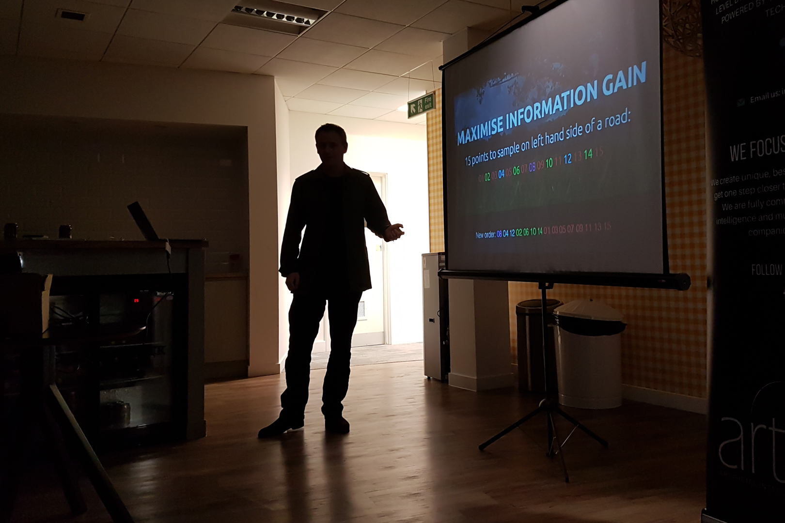

# 🧛 Phil Stubbings

Nocturnal 🦇 life-form based in South Wales 🏴󠁧󠁢󠁷󠁬󠁳󠁿

# 🖤 Things

* 🎨 Oil painting and drawing [Instagram](https://www.instagram.com/philstubbingsart/)
* 🖋️ Random [Blogging](https://parasec.net/blog/)
* 💻 Coding [Github](https://github.com/phil8192)
* 🥉 [Kaggle](https://www.kaggle.com/edgecrusher)
* 🐦 [Twitter](https://twitter.com/vectorinversion)
* 🐘 [Mastodon](https://mastodon.social/@nocturne_protocol)
* 🎹 [Spotify](https://open.spotify.com/user/13uygzy0tebw2hgmt4jt3qb6k?si=GiIJzy_0RcOMl__PUKvS3g)

# ⌨️ Work

I'm a Data Scientst and Software Engineer working in the areas of Artificial Intelligence and Machine Learning. I currently work in the area of [Privacy-enhancing technologies](https://en.wikipedia.org/wiki/Privacy-enhancing_technologies). I'm also interested in [market-microstructure](https://en.wikipedia.org/wiki/Market_microstructure), algorithmic trading and extracting signals from obscure data-sources. CV on [LinkedIn](https://www.linkedin.com/in/sphil/)

## 🏢 Places

* [Wunderman Thompson MAP](https://wt-map.com/) Staff Data Scientist (current)
* [Harvard University OpenDP](https://opendp.org/people/philip-stubbings) Visiting Fellow
* [LiveRamp](https://liveramp.com/) Staff Data Scientist
* [DataFleets](https://techcrunch.com/2021/02/09/encrypted-data-handling-startup-datafleets-acquired-by-liveramp-for-over-68m/) Research Software Engineer (acquired by LiveRamp)
* [Office for National Statistics](https://datasciencecampus.ons.gov.uk/) Lead Data Scientist
* [Evogro](https://www.evogro.com/) Machine Learning Software Engineer
* [Arkasoft](http://www.arkasoft.com/) Principal Software Engineer
* [Velti](https://www.velti.ai/) Senior Software Engineer
* [British Telecom](https://atadastral.co.uk/) Research Scientist

## 👨‍🎓 Academics

* MSc Computer Science
* BSc Artificial Intelligence
* NVQ Fine Art

## 📘 Publications

Google Scholar [profile](https://scholar.google.co.uk/citations?user=kg1_CuEAAAAJ&hl=en)

* [Feature space hijacking attacks against differentially private split learning](https://arxiv.org/abs/2201.04018)
* [A hierarchical urban forest index using street-level imagery and deep learning](https://www.mdpi.com/2072-4292/11/12/1395/htm)
* [Modular neural networks for recursive collaborative forecasting in the service chain](https://www.sciencedirect.com/science/article/abs/pii/S0950705108000440)
* [Collaborative demand forecasting in service chains](https://link.springer.com/chapter/10.1007/978-3-540-75504-3_16)

## 💡 Patents

* [Differentially private split vertical learning](https://patents.google.com/patent/WO2023081183A1/en)
* [Data analytics privacy platform with quantified re-identification risk](https://patents.google.com/patent/WO2022061162A1/en)
* [Analytics platform for federated private data](https://patents.google.com/patent/WO2022061165A1/en)
